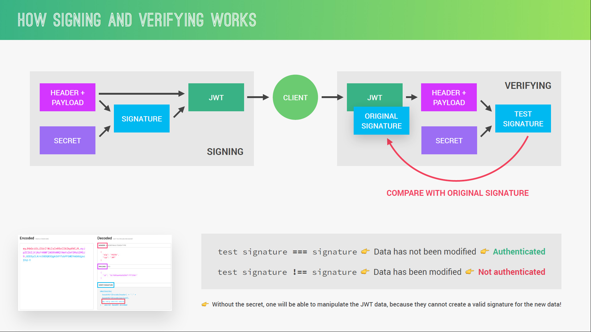

# Natours-Api Part-2

### 04-08-2020: ERROR HANDLING WITH EXPRESS

<li> Debugging Node.js with ndb: node-debugger</li>
<li> 2 types of errors: Operational and Programming Errors</li>
<li> Global Error handling done using middlewares!</li>
<li> Customize the errors for development and production seperately!</li>
<li> Set up error handling for Async Function, Invalid Database ID's, Duplicate Name, Validation Errors,Unhandled Rejections and Uncaught Expressions!</li>

### 06-08-2020: AUTHENTICATION, AUTHORIZATION AND SECURITY

</img>

</img>

#### Checkout the Code!

Includes authorization, authentication and security aspects for the user section of the website!
